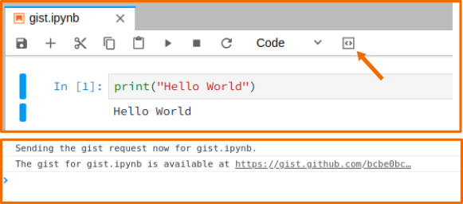

**IMPORTANT: unfortunately GH deprecated Gist creation without authentication: https://blog.github.com/2018-02-18-deprecation-notice-removing-anonymous-gist-creation/ So this extension won't work before a GH auth feature is added to it. PRs are welcome!**

# jupyterlab_gist
[](https://travis-ci.org/hadim/jupyterlab_gist)

A Jupyterlab extension to post notebook to gist.



## Prerequisites

* JupyterLab

## Installation

```bash
jupyter labextension install @hadim/jupyterlab_gist
```

## Development

For a development install (requires npm version 4 or later), do the following in the repository directory:

```bash
yarn install
yarn build
jupyter labextension link .
```

To rebuild the package and the JupyterLab app:

```bash
yarn watch
jupyter lab --watch
```

To release a new version:

```bash
yarn publish
```

## Authors

`jupyterlab_gist` has been created by [Hadrien Mary](mailto:hadrien.mary@gmail.com).

## License

MIT. See [LICENSE](LICENSE)